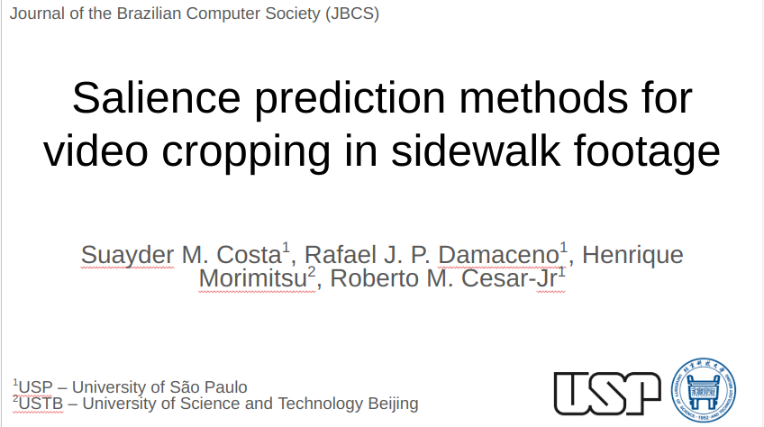

# JBCS-video-saliency [REPO UNDER CONSTRUCTION]

## Experiments

Models references:

- ViNet - https://github.com/samyak0210/ViNet
- TMFI-Net - https://github.com/wusonghe/TMFI-Net

## DEMO

## Dataset

**Table: Total duration in seconds and total number of frames for each video sample extracted from the dataset, evaluated using human attention and tactile paving methods.**

| ID           | Duration (Human attention) | Frames (Human attention) | Duration (Tactile paving) | Frames (Tactile paving) |
|--------------|----------------------------|---------------------------|----------------------------|--------------------------|
| J-HSV-B01    | 241.94                     | 7,259                     | 241.94                     | 7,259                    |
| J-HSV-R01    | -                          | -                         | 139.82                     | 4,195                    |
| J-HSV-R02    | -                          | -                         | 69.66                      | 2,090                    |
| S-CHE-B01    | 330.32                     | 9,910                     | -                          | -                        |
| S-HM-B01     | 321.43                     | 9,644                     | 321.43                     | 9,644                    |
| SP-HC-R01    | 239.77                     | 7,194                     | -                          | -                        |
| SP-HC-R02    | 689.88                     | 20,680                    | 40.00                      | 1,200                    |
| SP-HU-R01    | 190.71                     | 5,722                     | -                          | -                        |
| SP-HU-R02    | 151.08                     | 4,533                     | -                          | -                        |
| **All**      | **2,165.13**               | **64,942**                | **812.85**                 | **23,388**               |

## Scripts

- `click2attention_maps.py`

## evaluation

The individual evaluations can be done inside `saliency/` folder, which will have a notebook computing the mean of the saliency.

This code is a version of the original one: https//github.com/herrlich10/saliency

## auxiliary scripts

#### generate fixation maps

run `click2fixation.py`, pay attention to change the paths in class PATHS.
